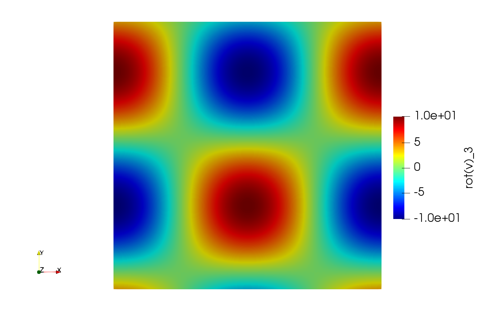

## Vortex_TG

Traveling 2D Taylor:Green vortex example proposed in M. Minion & R. Saye, _Higher-order temporal integration for the incompressible Navier-Stokes equations in bounded domains_, J. Comput. Phys. 351: 797-822, 2018. The example is extended to 3D by imposing periodicity in the z-direction, see J. Stiller, _A spectral deferred correction method for incompressible flow with variable viscosity_, [arXiv:2001.11902](https://arxiv.org/abs/2001.11902), 2020. 

### Standalone test

Test case with fixed parameters that is small enough to be run on a single core in interactive mode. It reads the default input file `isp_flow__sdc_test.prm` and the problem-specific file `vortex_tg.prm`. For more details on the parameters see the problem module defined in `isp_flow_problem__vortex_tg.f`.

Run the test with

    mpirun -n 1 ../isp_flow__sdc_test

Upon successful completion it produces the Partitioned VTK Unstructured Data file `vortex_tg.pvtu`, which can be visualized using ParaView. The following example shows the z-component of the computed vorticity at $$t=0.25$$. 

### SDC convergence with increasing number of subintervals

This test explores the convergence of the SDC method for a increasing number of subintervals $$M$$. The minimal test configuration can be run interactively with

    bash -l sdc_m.sh

If enough cores are available it can be run also with 4 processes

    export NP1=2
    export NP2=2
    export EP=2
    bash -l sdc_m.sh

Here,  `NP1` and  `NP2` are the number of partitions in directions 1 and 2, respectively, and `EP` the number of elements in these directions. The convergence results can be visualized with

    python3 sdc_m.py

The produced graph is stored in `convergence_dt.pdf`.  Here are the reference results:

On a HPC system you may run larger tests using the provided slurm script, e.g.

    sbatch sdc_m.slurm

In the slurm script you may adjust a number of parameters

* `NP1`: number of partitions in direction 1
* `NP2`: number of partitions in direction 2
* `EP`: number of elements in directions 1 and 2
* `T_END`: final time $$T$$ 
* `N_SUB_MAX`: maximum number $$M_{\max}$$ of subintervals used with SDC
* `DT_MAX`: maximum time step size $$\Delta t_{\max}$$ 
* `ST_MAX`: maximum number of time reductions per series: $$\Delta t_k = 2^{-k/2} \Delta t_{\max}$$ for $$k=0$$  to  `ST_MAX` 

Note that deviating from preset $$M_{\max} = 3$$ requires changes in `sdc_m.py`, too.

Addtionally you can modify the problem parameters in `vortex_tg.prm`. For example, to obtain the fully periodic case change all occurences of `'D'`in  the boundary conditions `bc` to `'P'. 

### SDC convergence with increasing number of correction sweeps

In this test, the number of subintervals $$M$$ is fixed, while the number of correction sweeps increases from $$K = 0$$ to $$K_{\max} = 3M$$. The number of subintervals is preset to 3, which can be overridden by setting `N_SUB` in the slurm script `sdc_k.slurm`. All remaining parameters correspond to the previous case.

The test can be run with

    bash -l sdc_k.sh

possibly using more processes as explained above, or with slurm

    sbatch sdc_k.slurm

The results are processed with

    python3 sdc_k.py

which produces the output file `sdc_k.pdf`, e.g. with default parameters:

